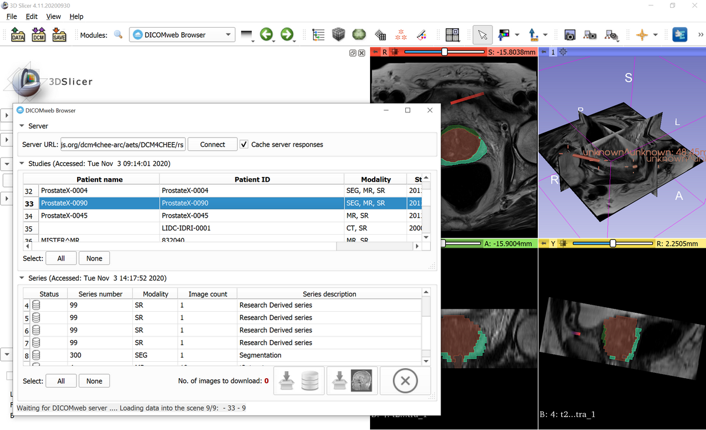

# DICOMwebBrowser

## Introduction

DICOMwebBrowser is [3D Slicer](http://slicer.org/) extension for browsing and downloading medical imaging collections from DICOMweb databases.

## Installation

- Install DICOMwebBrowser extension in 3D Slicer
- Open DICOMwebBrowser module
- Set server URL, for example https://server.dcmjs.org/dcm4chee-arc/aets/DCM4CHEE/rs
- Click Connect

## Usage
- Open DICOMwebBrowser module
- Select studies or series
- Click "Download and index" button to download selected data set into Slicer database or click "Download and load" button to also load the data into the scene

## Acknowledgments

This work is supported in part by the following National Institutes of Health grant:

* Quantitative Image Informatics for Cancer Research [QIICR](http://qiicr.org/) (U24 CA180918, PIs Kikinis and Fedorov)

## Contributors:

* Andras Lasso (PerkLab, Queen's)
* Alireza Mehrtash (Brigham and Women's Hospital)
* Andrey Fedorov (Brigham and Women's Hospital)

## License

* [Slicer License](http://www.slicer.org/pages/LicenseText)
